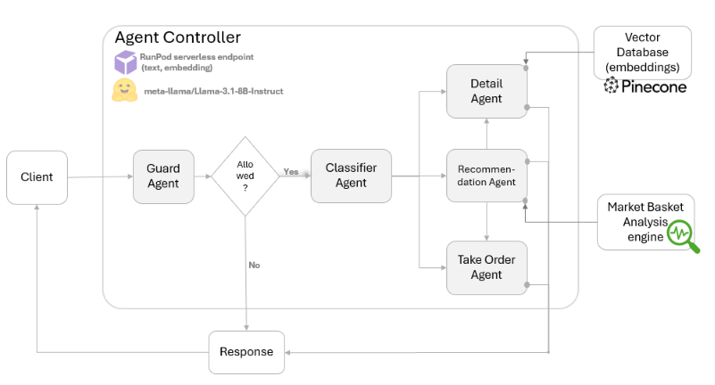

# Multi-Agent Coffee Shop Assistant

[Watch the project video](https://www.youtube.com/watch?v=3CvPp7rMKX4)

This is a **personal learning project based on a tutorial**, which I implemented to gain hands-on experience with **multi-agent LLM architectures, Retrieval-Augmented Generation (RAG), recommendation systems, and LLM-driven application actions**.

The objective is to explore how a conversational assistant could improve the customer experience and potentially increase sales in a coffee shop by allowing users to ask questions, receive product recommendations, and place an order directly through the chat interface.

## Architecture

The system uses **five LLM-based agents**, implemented with **`meta-llama/Llama-3.1-8B-Instruct`**, with each agent responsible for a specific part of the interaction:

- **Guard Agent**  
  Determines whether the user's request is appropriate for the coffee shop assistant and can be processed.

- **Classification Agent**  
  Analyses the user's message and routes the request to the most appropriate specialised agent.

- **Detail Agent**  
  Answers questions about the coffee shop and its products, such as opening hours, location, ingredients, or etc. It uses **RAG with Pinecone** to retrieve relevant information before generating the response.

- **Recommendation Agent**  
  Generates product recommendations based on the user's request. Recommendations can include popular products, category-based suggestions, and products frequently purchased together using results from **Market Basket Analysis**, based on historical coffee shop transaction data.

- **Take Order Agent**  
  Manages the conversational ordering process, incorporates selected recommendations, confirms the final order, and produces the structured information required to add the order to the cart and send it to the barista.

## Main Takeaways

- **LLMs are probabilistic**, which makes them flexible for natural customer interactions but also introduces challenges when predictable behaviour is required. Prompt design and output validation therefore become important.

- **Application-level actions** such as adding products to a cart or submitting an order require **structured, machine-readable outputs (e.g., JSON)**, together with validation and error-handling mechanisms, rather than relying only on natural-language responses.

- **Agent specialisation and routing** can separate responsibilities such as information retrieval, recommendations, and transactional actions instead of expecting a single LLM to manage the entire workflow.

- A production system would require stronger **evaluation, monitoring, logging, and reliability controls** before deployment.

## Future Work

Potential next steps include:

- Reference-based and reference-free evaluation of agent responses.
- LLM-as-a-Judge evaluation and validation of the judge itself.
- Simulated user scenarios for testing multi-step conversations.
- Monitoring response quality, failures, and user frustration.
- Evaluating modern agent-development frameworks that can simplify orchestration, tool use, state management, and evaluation.
